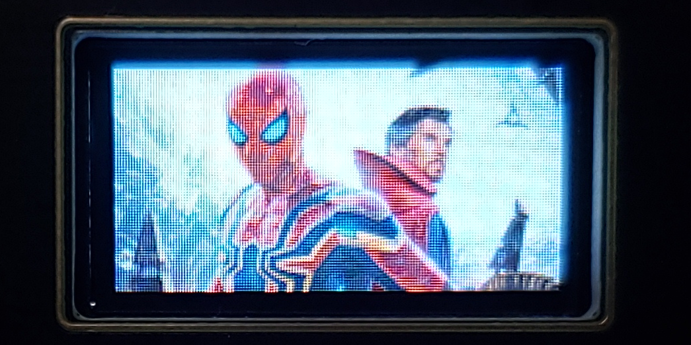
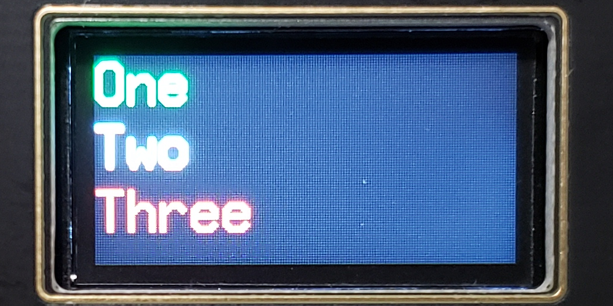
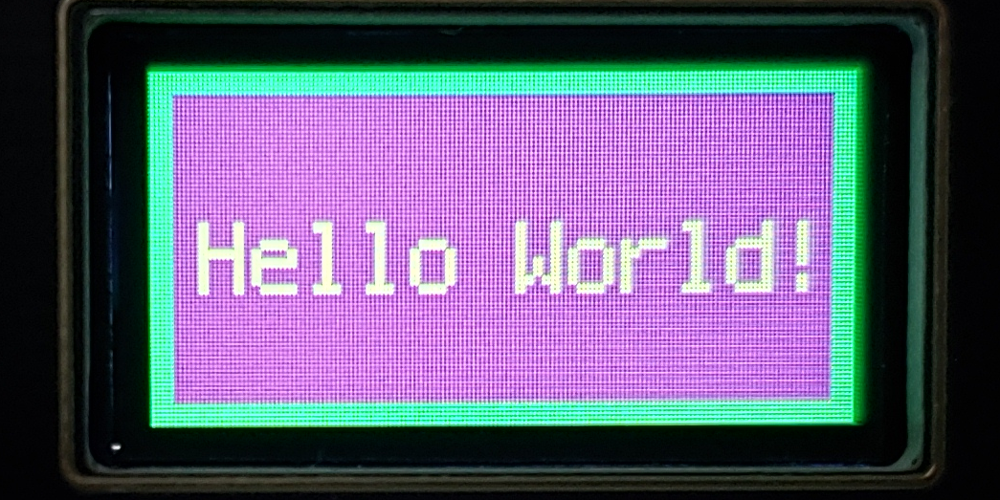

# Waveshare-RP2040-LCD-0.96
Sample Code for Waveshare RP2040-LCD-0.96

I purchased the Waveshare RP2040-LCD-0.96 from Amazon and found that there were few CircuitPython examples to use the functions of the board.

- Amazon Product: <a href="https://smile.amazon.com/gp/product/B09LT5LYPD/ref=ppx_yo_dt_b_asin_title_o01_s00?ie=UTF8&th=1"
- Waveshare Store: <a href="https://www.waveshare.com/RP2040-LCD-0.96.htm">https://www.waveshare.com/RP2040-LCD-0.96.htm</a>
- Waveshare Wiki: 

<strong>CircuitPython Sample Code for LCD</strong>

- Display a bitmap (BMP) image
	- Code/LCD-Image
	- Modified from <a href="https://tutorial.cytron.io/2021/12/21/display-image-on-the-graphic-lcd-using-maker-nano-rp2040-and-circuitpython/">https://tutorial.cytron.io/2021/12/21/display-image-on-the-graphic-lcd-using-maker-nano-rp2040-and-circuitpython/</a> <i>Display image on the graphic LCD using maker nano rp2040 and CircuitPython</i>
	- Sample Image 
- Display simple text
	- Code/LCD-Simple-Text
	- Sample Image 
- Display Graphics and Text
	- Code/LCD-Grapics-n-Text
	- Modified from <a href="https://learn.adafruit.com/1-8-tft-display/displaying-bitmaps?view=all">https://learn.adafruit.com/1-8-tft-display/displaying-bitmaps?view=all</a> <i>1.8" TFT Display Breakout and Shield</i>
	- Sample Image 

<strong>LCD Pins</strong>

- GP8 - LCD_DC
- GP9 - LCD_CS
- GP10 - LCD_CLK
- GP11 - LCD_DIN
- GP12 - LCD_RST
- GP25 - LCD_BL

<strong>Other Notes</strong>

- Battery Connector
	- The connector is 1.25mm not 2.0mm so most LiPo batteries will not fit. It will be necessary to obtain MX1.25 connectors and carefully splice to the Lithium battery. Not certain if micro JST connectors are the same or will fit.

